
Realisée par : ESSABIR HAJAR

_________________________________________________________________________________________________
<h1>Rapport de TP1 : Inversion de Contrôle et Injection des dépendances</h1>
<h2 style="color:skyblue">Introduction</h2>

Ce présent rapport se penche sur les fondements théoriques de l'Inversion de Contrôle (IoC) et de l'Injection de Dépendances (DI) dans le contexte du développement logiciel. Ces concepts, au cœur des préoccupations actuelles en matière de conception logicielle, visent à améliorer la modularité, la testabilité et la maintenabilité des applications. À travers une analyse approfondie, nous explorerons les avantages substantiels, les justifications sous-jacentes, et les implications pratiques de l'IoC et de la DI. 

<h2 style="color: skyblue">Conception</h2>
<h3>Principe du couplage faible</h3>
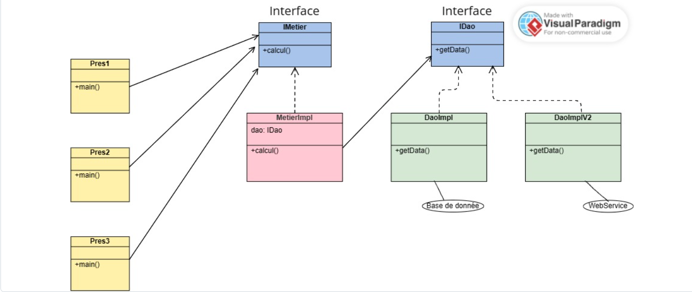

L'utilisation d'interfaces revêt une importance cruciale dans la minimisation du lien fort entre les différentes classes. Par exemple, en associant MetierImpl à l'interface IDao, on instaure un lien souple. Ainsi, MetierImpl peut interagir avec n'importe quelle classe respectant les règles définies par IDao sans qu'il soit nécessaire de modifier directement MetierImpl. Cette approche confère une flexibilité accrue au système et accroît sa résilience face à des changements internes, favorisant ainsi la conception d'applications robustes et adaptables.

Le choix d'un couplage souple conduit généralement à la création d'applications qualifiées de « fermées pour modification » (où les classes existantes demeurent inchangées) et « ouvertes pour extension » (offrant la possibilité d'ajouter de nouvelles classes respectant l'interface sans perturber le fonctionnement des classes déjà en place

<h2 style="color: Skyblue">Captures d'écrans</h2>
<h3>Création de l'interface IDao</h3>
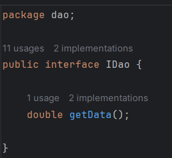
<h3>Création d'une implémentation de l'interface IDao version Base de Données</h3>
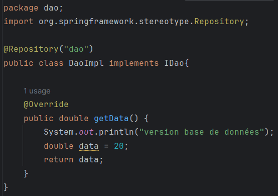
<h3>Création d'une implémentation de l'interface IDao version web services</h3>
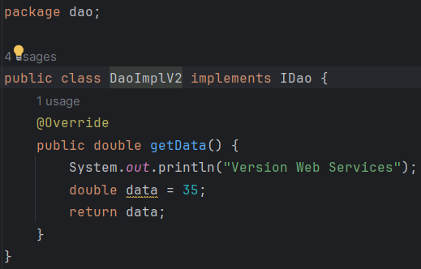

<h3>Création de l'interface IMetier</h3>
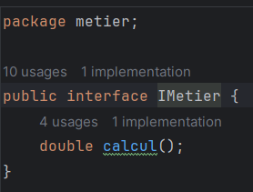
<h3>Création d'une implémentation de l'interface IMetier</h3>
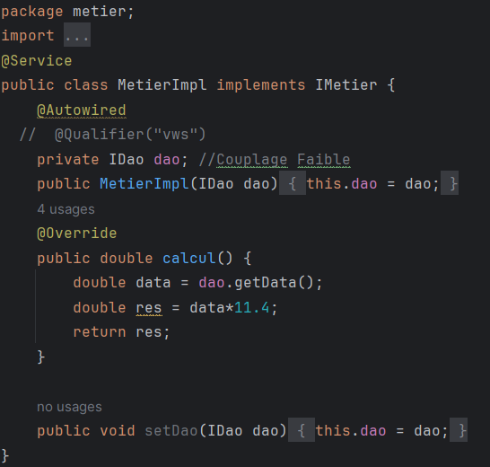
<h3>Instantiation statique</h3>
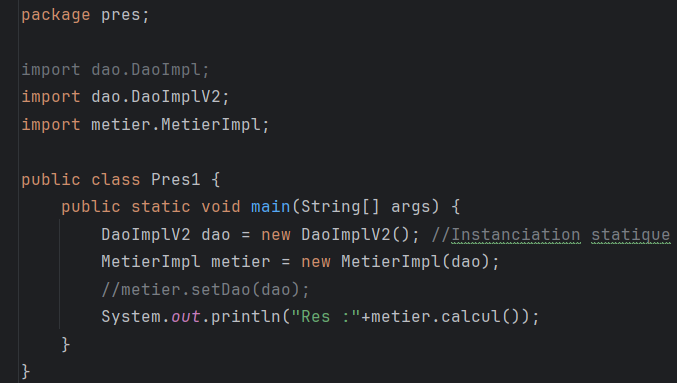
<h3>Instantiation dynamique</h3>
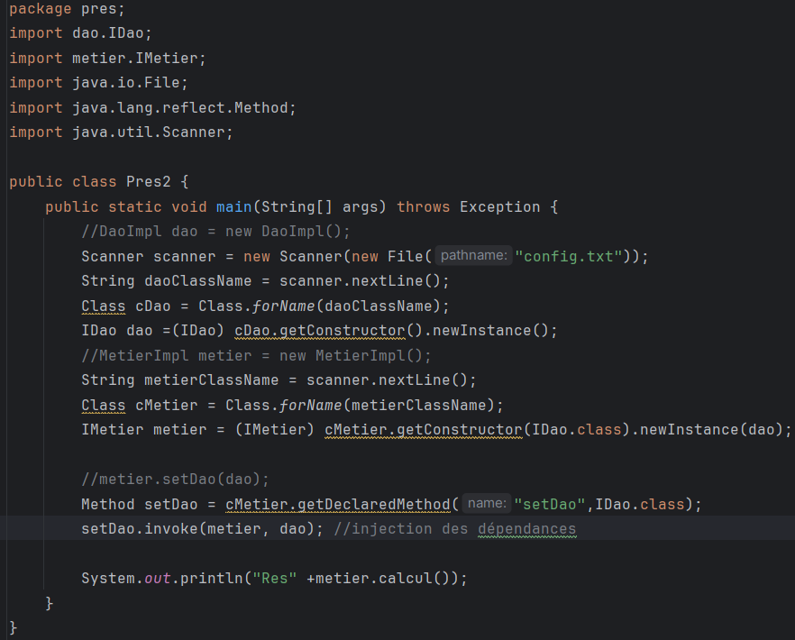

L'ajout d'un fichier "config.txt" :

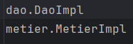
<h3>Injection des dépendances en utilisant Spring version xml</h3>
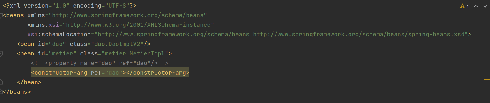
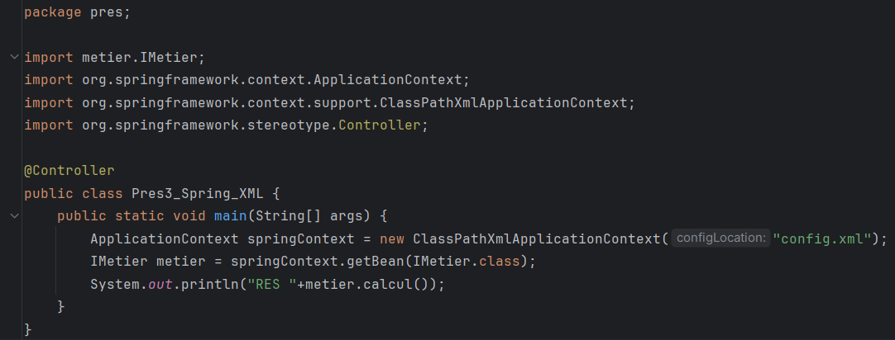
<h3>Injection des dépendances en utilisant Spring version annotations</h3>

Repository Class

@Repository : Cette annotation signale que la classe est un composant de persistance, couramment employé pour les opérations d'accès aux données.

Service Class

@Service : Cette annotation sert à identifier une classe en tant que service. Les classes de service intègrent la logique métier de l'application. Les classes annotées avec @Service sont repérées et gérées par Spring.

Controller

@Controller : Cette annotation est utilisée pour marquer une classe en tant que contrôleur dans le contexte Spring MVC.

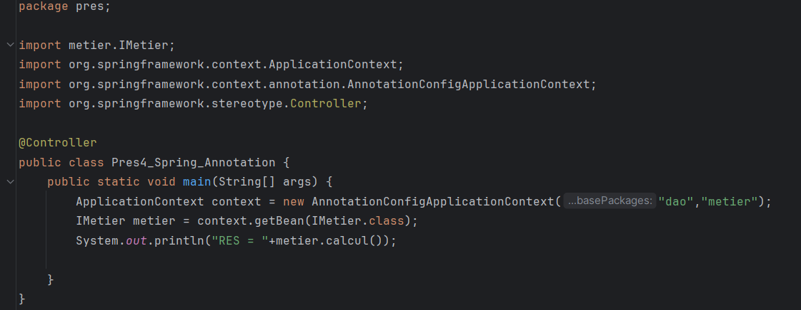
<h2 style="color:skyblue">Conclusion</h2>

En conclusion, cette étude approfondie a examiné de près les principes clés de l'inversion de contrôle (IoC) et de l'injection de dépendances (DI) dans le domaine du développement logiciel. Les implications de ces concepts sur la modularité, la testabilité et la maintenabilité des applications ont été soigneusement analysées. Les exemples pratiques ont illustré la réduction du couplage grâce à l'utilisation d'interfaces et à l'intégration du Spring Framework. Comprendre et appliquer ces principes s'avère essentiel pour concevoir des applications flexibles, adaptables aux changements internes, et constitue un socle robuste pour le développement de logiciels modernes.

